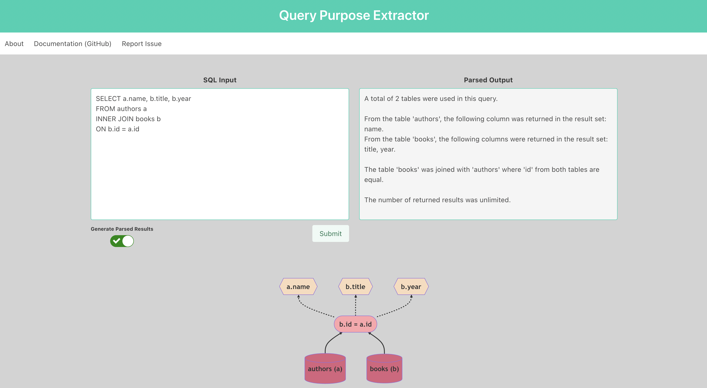

# Query Purpose Extractor (QPE)

QPE is an application built with the goal of making Structured Query Language (SQL) more accessible and understandable to non-technical or beginning-to-be-technical users.



https://query-pe.dev

## Installation

1. Clone this repository into a local directory on your machine.
2. Navigate to your new repository root in your terminal. Execute the below commands:  
```
# Create a new virtual environment
python3 -m venv venv

# Activate virutal environment
source venv/bin/activate

# Install python dependencies
pip install -r requirements.txt

# Deactivate environment
deactivate

# Install npm dependencies
npm install
```

## Running the Application

1. Open two terminal windows. Navigate to the root of your cloned repository in both windows.
2. In the first window, run the command `yarn start-api`. This will begin your backend instance.
3. In the second window, run the command `yarn start`. This will begin your frontend instance.
4. A browser window should appear, but if it does not open one and navigate to `localhost:3000`
5. You should be greeted with the landing page and can now interact with the application.